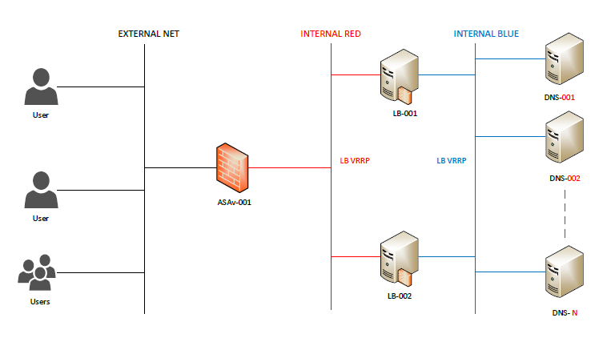
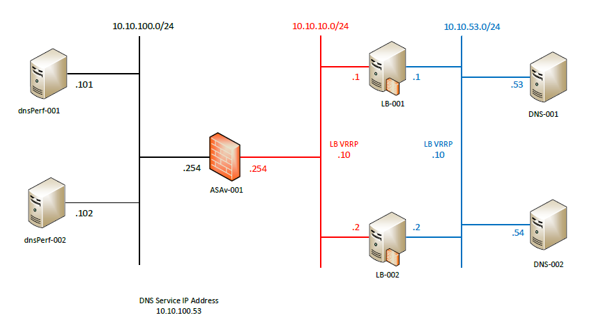
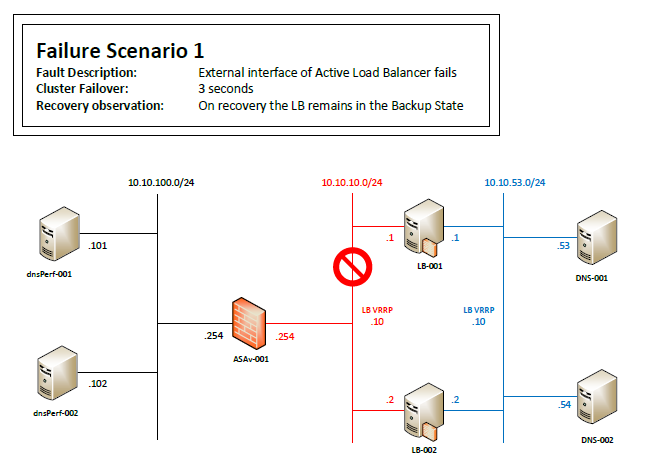
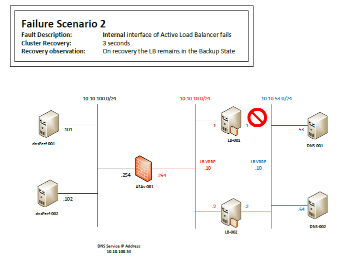
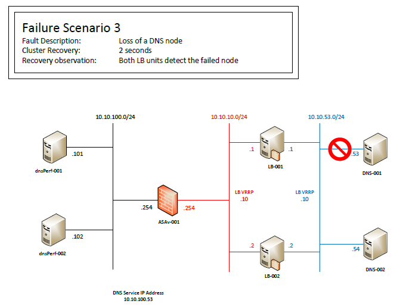

## Just an idea about how to load-balance DNS requests
### Properties:
- [x] Reliable
- [x] Scalable
- [x] Secure (As secure as the components)
- [ ] Easy to deploy (TBD)

Strong Points | Weak Points
------------- | -------------
TBD | TBD
TBD | TBD

General idea (how it should look):

Proof of concept (POC implementation):

Failure scenarios tested:

For other details see the images directory

|15.12.2015|
------------
